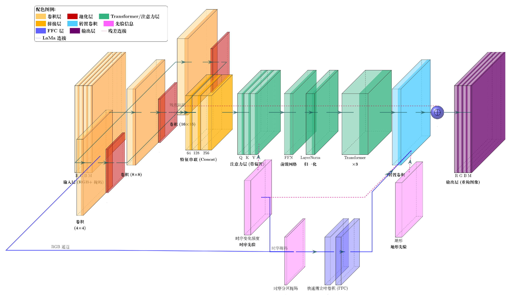
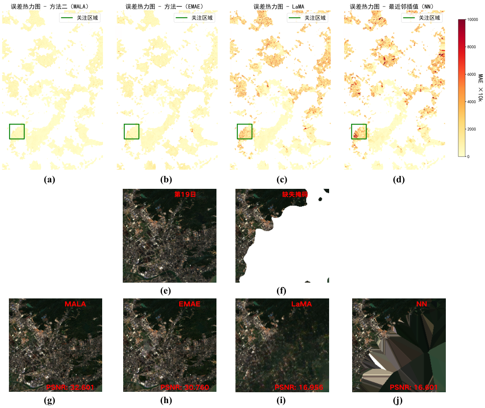
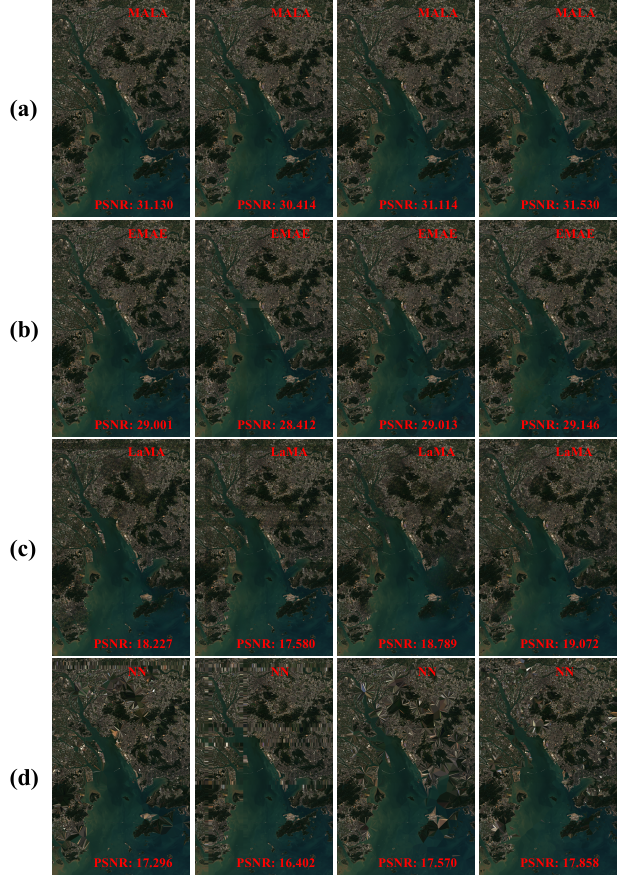

# MALA: 面向遥感影像光谱插补的时空协同生成框架

> MALA is a temporal-spatial collaborative reconstruction framework for remote sensing image interpolation under cloud, strip, and mixed missing patterns.

## 项目简介

遥感影像在华南沿海、珠江口等多云多雨区域，常常受到云覆盖、条带缺失和复杂大气条件的共同影响，导致长时序观测中存在大面积无效区域。仅依赖空间邻域的方法，往往难以恢复真实的时间变化过程；仅依赖时序建模的方法，又容易在高空间异质区域丢失纹理细节。

`MALA` 的核心目标，就是同时回答两个问题：

- 缺失区域在时间上应该如何演化？
- 缺失区域在空间上应该如何恢复细节？

围绕这个目标，本仓库实现了两条主线方法：

- `EMAE`：融合时序注意力与空间卷积的增强型掩码自编码器。
- `MALA`：在 EMAE 基础上进一步引入 LaMA 纹理修复能力的时空协同框架。

下面的 README 只围绕三张核心图展开，帮助访客快速理解方法设计、典型结果和整体优势。

## 图 1. MALA 模型架构



这张图对应整个方法的主体设计，可以概括为“多尺度编码 + 时序建模 + 先验引导 + 协同解码”。

### 图中表达的关键思想

- 输入为 `RGB + 掩码`，模型显式知道哪些区域缺失、哪些区域有效。
- 编码端使用 `4x4 / 8x8 / 16x16` 多尺度卷积分支，对不同尺度地物同时建模。
- 多尺度特征在中间进行 `Concat`，形成统一的时空表征。
- 主干部分采用 `Transformer / 时序注意力层`，重点学习缺失区域在时间维上的变化规律。
- `时序先验` 用来强化时间变化强度信息，使模型在小样本时序场景下更容易学到有效演化模式。
- `地形先验` 与 `FFC / LaMA 连接` 帮助模型补足高空间异质区域的局部纹理信息。
- 解码端输出重构图像，实现对缺失遥感观测的恢复。

### 这张图想传达什么

`EMAE` 更偏向回答“时间上应该长成什么样”；`MALA` 则在此基础上进一步回答“空间上应该看起来像什么样”。因此，本项目并不是单纯做图像修补，而是把时序生成和空间纹理恢复结合在一起。

## 图 2. 典型区域的重构结果与误差对比



这张图展示了一个典型局部区域的对比结果，包含误差热力图、原始样本、缺失掩码以及不同方法的重建结果。

### 图中各部分含义

- 上排 `(a) - (d)`：分别是 `MALA`、`EMAE`、`LaMA`、`NN` 的误差热力图。
- 中排 `(e) - (f)`：分别是真实观测图像与缺失掩码图像。
- 下排 `(g) - (j)`：分别是四种方法的重构结果以及对应 `PSNR`。

### 从这张图可以直观看到

- `MALA` 的误差分布最集中，热点最少，说明其在目标区域的重构误差最小。
- `EMAE` 也能恢复主体结构，但在边缘细节和局部纹理上略弱于 MALA。
- `LaMA` 在纯纹理修复上有一定作用，但面对大范围遥感缺失时容易出现时序不一致和颜色漂移。
- `NN` 的块状伪影最明显，尤其在复杂区域中会产生不自然的几何边界。

### 典型区域的 PSNR 对比

| 方法 | PSNR |
|------|-----:|
| MALA | 32.601 |
| EMAE | 30.760 |
| LaMA | 16.956 |
| NN | 16.601 |

这说明在局部典型区域中，`MALA` 不仅视觉质量最好，而且定量指标也最优。

## 图 3. MALA 多方法定量对比



这张图展示了多个场景下 `MALA`、`EMAE`、`LaMA` 与 `NN` 的重构结果和 PSNR 对比。每一列可以理解为一个不同的测试样例或缺失设置，每一行对应一种方法。

### 从多场景结果中得到的结论

- `MALA` 在 4 个样例中都保持最高 PSNR，说明方法优势不是单一案例偶然现象。
- `EMAE` 在多数场景下稳定优于 `LaMA` 和 `NN`，说明时序生成建模对遥感插补是有效的。
- `LaMA` 在自然图像纹理修复中表现较强，但在大范围遥感缺失任务中缺乏稳定的时序约束。
- `NN` 的结果最不稳定，伪影明显，在复杂水陆边界和纹理混合区域表现最弱。

### 图中 4 组样例的 PSNR

| 场景 | MALA | EMAE | LaMA | NN |
|------|-----:|-----:|-----:|-----:|
| 场景 A | 31.130 | 29.001 | 18.227 | 17.296 |
| 场景 B | 30.414 | 28.412 | 17.580 | 16.402 |
| 场景 C | 31.114 | 29.013 | 18.789 | 17.570 |
| 场景 D | 31.530 | 29.146 | 19.072 | 17.858 |

### 这张图说明了什么

当测试样例发生变化、缺失位置和局部纹理复杂度发生变化时，`MALA` 依然能保持更高、更稳定的重建性能。这也是它相比单纯空间方法或单纯纹理修复方法更有优势的关键原因。

## 方法总结

结合以上三张图，可以把本项目的算法思想总结为一句话：

> 先用 EMAE 学习遥感影像在时间维上的演化规律，再用 MALA 将时序生成与空间纹理修复协同起来，从而在复杂缺失场景下获得更高质量的重构结果。

如果进一步展开，就是三点：

- `时序上`：用注意力机制学习缺失区域应该如何随时间变化。
- `空间上`：用多尺度卷积和 LaMA 分支恢复局部细节与纹理连续性。
- `先验上`：用掩码、时序变化信息和场景先验共同约束重建过程。

## 仓库能做什么

当前代码库支持以下研究流程：

- 缺失数据模拟与数据预处理
- 模型训练与微调
- 遥感影像推理与重建
- 多方法指标统计
- 误差热力图、裁剪区域和时序分析

当前主干代码已经按 `data / models / utils / engine / analysis` 进行了模块化整理：

- `data/` 负责数据集与掩码组织
- `models/` 负责模型结构与核心组件
- `utils/` 负责指标与可视化
- `engine/` 负责配置对象、构建器、损失函数、训练循环与推理循环
- `analysis/` 负责分析脚本共享的目录遍历、算法映射与结果解析

如果你希望使用统一流水线入口，优先查看：

- `integrated_vmae/vmae_pipeline.py`

如果你希望从当前 MALA 主干实验代码直接开始，优先查看：

- `train.py`
- `inference.py`
- `MAE_LaMa.py`

## 仓库结构

```text
MALA/
├── README.md
├── docs/figures/                    # README 使用的三张核心图
├── docs/MODULARIZATION.md           # 模块化结构说明
├── data/                            # 数据读取与数据集定义
├── models/                          # 主模型组件
├── utils/                           # 指标与可视化工具
├── engine/                          # 训练/推理/配置/构建器
├── analysis/                        # 分析脚本共享辅助模块
├── MAE_LaMa.py                      # 原始研究型主脚本
├── train.py                         # 模块化后的训练入口
├── inference.py                     # 模块化后的推理入口
├── error_heatmap.py                 # 误差热力图分析
├── metrics_results.py               # PSNR / SSIM / MAE 统计
├── crop_img.py                      # 感兴趣区域裁剪
├── Scatter_one_to_one.py            # 散点一致性分析
├── time_analysis_Crops.py           # 时序局部分析
└── integrated_vmae/                 # 整合后的完整流程版本
```

## 快速开始

### 1. 环境安装

```bash
conda create -n mala python=3.10
conda activate mala
pip install -r requirements.txt
```

如果你的数据不在默认的 `E:/lama/...` 目录，也可以通过环境变量覆盖：

```bash
export MALA_DATA_ROOT=/your/data/root
export MALA_MASK_DIR=/your/masks
export MALA_LAMA_INIT_DIR=/your/lama_init
```

### 2. 模型训练

```bash
python train.py
```

### 3. 模型推理

```bash
python inference.py
```

### 4. 统一流水线

如果你希望按 `preprocess / train / finetune / infer / analyze` 五阶段运行，使用：

```bash
cd integrated_vmae
python vmae_pipeline.py --help
```

## 适用场景

- 多云雨地区的光学遥感影像修复
- 珠江口及近岸海域的水色遥感监测
- 海陆交错区域的时序缺失补全
- 面向生态监测、环境反演和上游数据重建的预处理任务

## 致谢

本项目面向遥感影像光谱插补与重构问题，聚焦复杂缺失场景下的时空协同建模。欢迎交流、复现和继续扩展。
