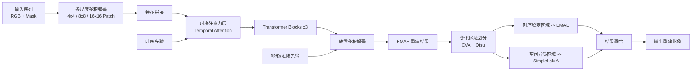

# MALA: 面向遥感影像光谱插补的时空协同生成框架

> A temporal-spatial collaborative framework for remote sensing image spectral interpolation and reconstruction.

## 项目概述

遥感影像在华南沿海等多云多雨地区常常受到云覆盖、条带缺失和复杂大气条件的影响，导致长时序观测中存在大面积缺失区域。传统方法通常只依赖空间邻域或时间连续性中的单一信息，难以同时兼顾快速变化区域的时序规律与高异质区域的空间纹理细节。

本项目围绕这一问题，构建了两类核心方法：

- `EMAE`：融合时序注意力与空间卷积的增强型掩码自编码器，用于在小样本条件下学习遥感影像的时序补全规律。
- `MALA`：在 `EMAE` 基础上，进一步结合 `LaMA` 的局部纹理修复能力，构建时空协同插补框架，在高空间异质和高缺失比例场景下获得更稳定的重建结果。

项目重点面向珠江口及华南沿海典型区域，使用 Sentinel-2 可见光三波段数据开展光谱插补实验，目标是在复杂缺失模式下实现更高的时序一致性、空间细节恢复能力和物理可信度。

## 方法思想

### 1. 问题定义

本项目关注三类典型遥感缺失场景：

- `云覆盖缺失`：模拟不规则云块对观测的遮挡。
- `条带缺失`：模拟传感器故障或扫描异常导致的条带空洞。
- `混合缺失`：同时包含云雾与条带，对模型鲁棒性要求更高。

模型输入为时序遥感影像及其对应掩码，输出为重建后的完整图像序列，并在缺失区域计算重建质量指标。

### 2. EMAE：时序建模为主的增强 MAE

EMAE 的核心思想是让模型不仅“看到缺哪里”，还要“理解时间上应该如何变化”。论文中的方法设计主要包含以下几部分：

- `多尺度 Patch 表征`：支持以不同 patch 尺度组织输入，以适配建筑、海洋、农田等不同尺度地物。
- `时序注意力建模`：在编码器中显式引入时间维注意力，捕捉短期快速变化与长距离时序依赖。
- `时序先验偏置`：通过时序变化强度信息为注意力计算提供额外引导，提升小样本场景下的补全能力。
- `预训练-微调策略`：先迁移自然图像中的通用视觉特征，再在遥感数据上微调，以缓解样本不足问题。
- `空间卷积增强`：在 MAE 框架中引入卷积结构，提升局部纹理表达能力。

从算法定位上看，EMAE 更强调“时间连续性是否合理”，尤其适合大范围缺失、短时变化显著、训练样本有限的遥感时序插补任务。

### 3. MALA：MAE 与 LaMA 的时空协同

MALA 进一步解决了“仅靠时序插补难以恢复高异质纹理细节”的问题。整体思想是先判断缺失区域更适合时间补全还是空间修复，再按区域采用不同策略：

- `变化区域划分`：基于变化向量分析（CVA）与 Otsu 阈值分割，将缺失区域划分为时序稳定与时序不稳定区域。
- `地物与地形先验引导`：结合海陆掩码及场景先验，辅助模型区分平稳区域与高异质区域。
- `EMAE 补时序`：对于更适合沿时间轴恢复的区域，由 EMAE 完成时序插补。
- `SimpleLaMA 修纹理`：对于空间结构复杂、局部纹理损失严重的区域，由 LaMA 进行空间精细修复。
- `协同重建`：最终将两类结果融合，兼顾时序一致性与空间细节。

简而言之，`EMAE` 解决“时间上应该长成什么样”，`MALA` 进一步解决“空间上应该看起来像什么样”。

## 结构示意

下图对应的算法框架可以概括为“多尺度卷积编码 + 时序注意力建模 + 先验引导 + 转置卷积解码 + LaMA 局部协同修复”：



## 结果解读

从你给出的误差热力图与可视化重建结果可以直观看到以下规律：

- `MALA` 的误差分布最集中、热点最少，在关注区域内的重建更平滑且边界更自然。
- `EMAE` 在多数场景下紧随其后，说明时序注意力对遥感缺失恢复是有效的。
- `LaMA` 能恢复一定局部结构，但在大面积遥感缺失下容易出现时序不一致或颜色漂移。
- `Nearest Neighbor (NN)` 在纹理复杂和缺失范围较大时会产生明显块状伪影，视觉质量最弱。

### 代表性对比结果

根据你提供的图示样例，几个典型场景中的 PSNR 表现如下：

| 场景 | MALA | EMAE | LaMA | NN |
|------|------:|------:|------:|------:|
| 城市局部区域样例 | 32.601 | 30.760 | 16.956 | 16.601 |
| 场景 A | 33.245 | 30.620 | 19.864 | 18.723 |
| 场景 B | 30.681 | 28.678 | 18.459 | 16.624 |
| 场景 C | 29.945 | 26.545 | 18.566 | 16.974 |
| 场景 D | 29.336 | 24.173 | 18.575 | 16.402 |

这些结果说明：

- `MALA` 在多个样例中都保持最优。
- `EMAE` 相较纯空间方法有稳定优势，证明时序生成建模是有效的。
- 当缺失范围扩大、区域异质性增强时，`MALA` 的优势更明显。

## 数据与实验设置

### 研究区域

论文实验聚焦于 `珠江口（Pearl River Estuary, PRE）` 及其近岸区域。这一区域具有以下特征：

- 云雾遮挡频繁，影像有效观测时刻稀少。
- 海陆交错明显，空间异质性高。
- 近岸海域光谱变化快，传统平滑插值方法难以建模。

### 数据来源

- `Sentinel-2 Level-2A Surface Reflectance`
- 可见光三波段：`B2 (490nm)`、`B3 (560nm)`、`B4 (665nm)`
- `MODIS` 陆地覆盖产品用于海陆掩码生成

### 缺失模式模拟

项目中重点考虑三类模拟缺失机制：

- `thin_cloud / cloud`：模拟不同尺度和不同强度的云遮挡
- `strip`：模拟传感器条带异常
- `mixed`：叠加多种缺失机制，逼近真实复杂场景

## 仓库结构

```text
MALA/
├── data/                         # 数据集读取与掩码组织
├── models/                       # 模型结构定义
├── utils/                        # 指标、可视化、辅助函数
├── train.py                      # 根目录 MALA 训练入口
├── inference.py                  # 根目录 MALA 推理入口
├── MAE_LaMa.py                   # 原始实验主脚本/研究型实现
├── error_heatmap.py              # 误差热力图分析
├── metrics_results.py            # PSNR/SSIM/MAE 汇总
├── crop_img.py                   # 感兴趣区域裁剪
├── Scatter_one_to_one.py         # 一对一散点图分析
├── time_analysis_Crops.py        # 时序区域分析
├── integrated_vmae/              # 并入的 VMAE 完整整合版代码
└── README.md
```

如果你希望使用完整的一体化流水线，包括 `preprocess / train / finetune / infer / analyze` 五阶段统一入口，建议优先查看：

- `integrated_vmae/vmae_pipeline.py`

如果你希望从当前 MALA 主干代码出发进行训练与推理，建议优先查看：

- `train.py`
- `inference.py`

## 快速开始

### 1. 环境配置

建议使用 Conda：

```bash
conda create -n mala python=3.10
conda activate mala
pip install -r requirements.txt
```

如果你准备运行整合版流水线，还可以参考：

```bash
cd integrated_vmae
pip install -r requirements.txt
```

### 2. 数据准备

代码默认围绕遥感时序影像、掩码图像、海陆先验组织数据。常见输入包括：

- 原始遥感影像序列
- 缺失掩码或预定义 mask
- 海陆掩码 / ocean mask
- 可选的 LaMA 初始修复结果

当前仓库中已包含部分示例数据与影像文件，例如：

- `S2_Daily_Mosaic_Masked/`
- `rgb_S2_Daily_Mosaic/`

### 3. 训练

使用根目录 MALA 版本训练：

```bash
python train.py \
  --data_dir /path/to/data \
  --ocean_mask_path /path/to/ocean_mask.png \
  --epochs 100 \
  --batch_size 4 \
  --lr 1e-4
```

### 4. 推理

```bash
python inference.py \
  --model_path ./fine_tuned_model.pth \
  --data_dir /path/to/test_data \
  --ocean_mask_path /path/to/ocean_mask.png \
  --mask_type mixed \
  --mask_ratio 0.3 \
  --output_dir ./results \
  --save_images \
  --save_visualization
```

### 5. 分析与可视化

项目中提供了多种面向论文和结果解释的分析脚本：

- `error_heatmap.py`：生成误差热力图
- `metrics_results.py`：批量计算 PSNR / SSIM / MAE
- `crop_img.py`：裁剪感兴趣区域
- `Scatter_one_to_one.py`：绘制学术风格一对一散点图
- `time_analysis_Crops.py`：分析局部区域的时序变化

## 项目亮点

- `面向真实遥感缺失场景`：不是简单随机缺失，而是重点面向云、条带和混合遮挡。
- `时序与空间协同建模`：EMAE 负责建模时间变化，MALA 进一步引入空间纹理修复。
- `适配小样本遥感任务`：采用预训练迁移、先验引导与微调策略提升小样本表现。
- `兼顾定量与定性分析`：不仅输出 PSNR / SSIM / MAE，也支持热力图、裁剪区域和时序分析。

## 适用场景

- 多云雨地区的光学遥感影像修复
- 珠江口、近岸海域等高动态水色遥感监测
- 农田、城市与海岸带交错区域的时序影像补全
- 面向赤潮预警、农田监测、海洋生态监测的上游数据重建

## 后续方向

项目当前已完成 EMAE 与 MALA 两条主线的实验实现。后续可以继续扩展：

- 更强的物理约束与光谱一致性校验
- 面向更长时序序列的高效 Transformer 建模
- 扩展到更多波段或多源遥感联合重建
- 将误差估计与不确定性量化纳入统一框架

## 引用

如果本项目对你的研究有帮助，欢迎在学术工作中引用相关论文或说明本仓库的使用来源。

## 致谢

本项目围绕遥感影像光谱插补与外推问题开展，研究思路来自于对珠江口等高动态、强遮挡场景下时空协同建模问题的持续探索。欢迎交流、复现与进一步改进。
